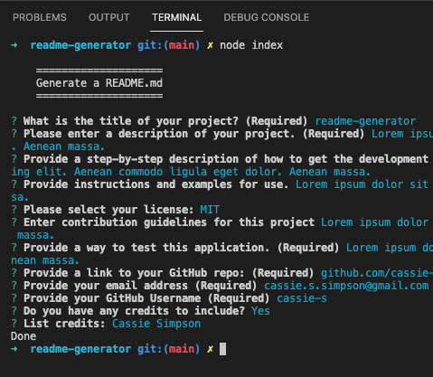

# README Generator
  
  ## Description
  Want a quick way to create a README.md file with having to use Markdown? The README Generator prompts for user input over the command line, generating a README.md file based on the input. The file is written to the 'dist' folder. 

  ## Table of Contents
  * [Installation](#installation)
  * [Usage](#usage)
  * [License](#license)
  * [Contributing](#contributing)
  * [Tests](#tests)
  * [GitHub](#github)
  * [Credits](#credits)

  ## Installation
  This application requires Node.js and two npm packages - File System(fs) and Inquirer.  
  [FS](https://nodejs.dev/learn/the-nodejs-fs-module)  
  [Inquirer](https://www.npmjs.com/package/inquirer#installation)

  ## Usage
  Answer all questions to generate a README.md file.
  

  ## License
    
  This project is uses  the [MIT](https://opensource.org/licenses/MIT) license.

  ## Contributing
  This is an open source project that follows the Contributor Covenant.  
  

  ## Tests
  Sample answers were using until a README.md file was successfully generated. The file can be modified if the input was not desired.  
  
  [Screencastify Link](https://watch.screencastify.com/v/KjIjtHAJbzrFs045JFxG)

  ## Questions
  Reach out via email or GitHub.  
  cassie.s.simpson@gmail.com  
  [cassie-s](https://github.com/cassie-s/)
